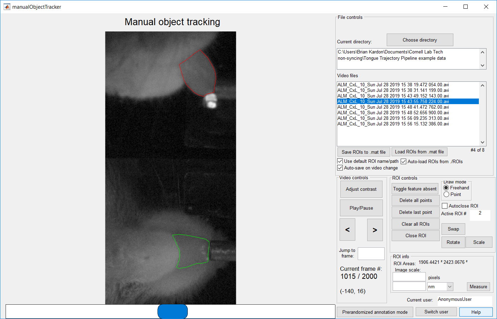

# manualObjectTracker User Manual
Manual object tracker is a MATLAB GUI designed to allow manual segmentation of objects in videos. Its intended use is the assembly of training sets for machine learning image segmentation algorithms.

####Please note: this user manual is a work in progress

## Modes
Normal mode:
>Use when you simply have one or more videos, and you want to manually segment objects in the videos.

Prerandomized annotation mode:

> Use when you want to randomly sample frames to segment from a large set of videos. This can help prevent overtraining of the algorithm on a small number of videos by spreading out the training set over a large number of videos.

## How to annotate a video
- Click on the filename of each video clip in the list in turn.
- The “center” frame of the clip, which should be the one to initially load, is the one to manually segment. You do not need to segment any of the other frames, as they are only there to help visually identify the feature through motion.
- Click or click and drag to draw a polygon around the feature.
- Various controls and keyboard shortcuts are described in the “help” dialogue (click the “Help” button). For example:
  - Right clicking will start and stop a zoom box to zoom in on the feature to allow more accurate annotations.
  - Pressing “a” will return the zoom level to normal.
  - Control-z will undo the last point entered.
- You can also mark one or both features as "absent" in a frame by clicking the "Absent" button.
- If you want to label a second feature, pressing “1” or “2” will switch between labeling feature 1 or 2. Make sure you stay consistent about which feature is 1 vs 2.
- At the moment, manualObjectTracker is designed to handle two separate ROIs in each frame. This is hardcoded, but can be easily changed by setting “handles.numROIs” to a different number.

## Normal Workflow

1.	Optional: If you are planning to have multiple users independently segment the clips for validation:
    - Click the “Switch user” button, and “sign in” so you can annotate under your own user ID.
    - Otherwise, you can skip this step to use the default AnonymousUser.
2. Select a directory that contains videos by clicking "Choose directory"
3. Select the video that you want to annotate from the video list

## Prerandomized Annotation Workflow

- Markdown: publish the Markdown text on a website that can interpret it (**GitHub** for instance),
- HTML: publish the file converted to HTML via a Handlebars template (on a blog for example).

1. Switch to prerandomized annotation mode by clicking the "Prerandomized Annotation Mode" button.
2. Create a prerandomized annotation file and associated video clips
    - This step allows you to randomly sample frames from an arbitrary number of videos to create a more balanced training set.
    -	The result of this step is a prerandomized annotation file, and a set of video clips, each consisting of a sampled frame, and several frames on either side (having several frames around each sampled frame can make visual segmentation easier).
    -	Click the “Create prerandomized annotation file” button. Use the popup to specify which videos to sample from, how many sample frames to take, and other parameters.
--	You can also do this from the command line – if you’ve done this, you can skip this step and choose an existing video clip directory and prerandomized annotation file instead.
3.	Optional: If you are planning to have multiple users independently segment the clips for validation:
    - Click the “Switch user” button, and “sign in” so you can annotate under your own user ID.
    - Otherwise, you can skip this step to use the default AnonymousUser.
4.	Manually segment the feature of interest in each random video clip. (see the [How to annotate](#How-to-annotate-a-video) section)
